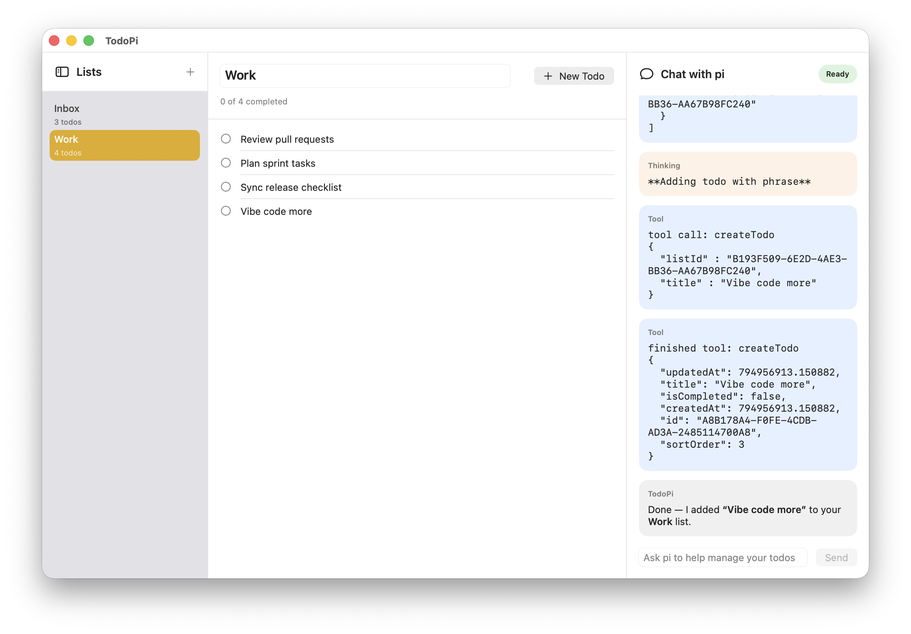

# TodoPi



TodoPi is a native macOS menubar todo app with a built-in chat panel for working with `pi`.

It stores todos locally, opens as a normal standalone window, and lets `pi` read and update your todo lists through an app-owned bridge.

## Current status

This repo is an in-progress macOS app, but the core app is already working:

- Menubar app with a standalone main window
- Multiple todo lists
- Local JSON persistence
- Manual create, edit, rename, delete, reorder, and complete flows
- Chat panel wired to a managed `pi` subprocess
- Local tool bridge so `pi` can operate on app-owned todos
- Persisted split layouts for the main panes and todo editor

## Requirements

- macOS 14+
- Xcode 16+
- `pi` installed locally if you want chat features

## Project layout

- `TodoPi/` — app source
- `TodoPiTests/` — unit tests
- `docs/design-plans/` — design notes
- `docs/implementation-plans/` — implementation plan

## Building

Open `TodoPi.xcodeproj` in Xcode and run the `TodoPi` scheme.

Or build from the command line:

```sh
xcodebuild -project TodoPi.xcodeproj -scheme TodoPi -destination 'platform=macOS' build
```

## Testing

```sh
xcodebuild -project TodoPi.xcodeproj -scheme TodoPi -destination 'platform=macOS' test
```

## Persistence

Todos are stored locally at:

`~/Library/Application Support/TodoPi/todos.json`

`pi` runtime data is stored under:

`~/Library/Application Support/TodoPi/`

## How `pi` is integrated

TodoPi launches `pi` in RPC mode and exposes a small local authenticated bridge for todo operations.

The app remains the source of truth for:

- models
- validation
- persistence
- UI state

`pi` acts as an assistant layer on top of that app-owned domain.

## Using TodoPi from normal `pi`

TodoPi now publishes bridge connection info at:

`~/Library/Application Support/TodoPi/bridge-runtime.json`

A global pi extension is included at:

`extensions/todopi.ts`

To install it for your normal pi sessions:

```sh
mkdir -p ~/.pi/agent/extensions
cp extensions/todopi.ts ~/.pi/agent/extensions/todopi.ts
```

Then run `/reload` in pi, or start a new pi session.

Available global tools include:

- `todopi_getLists`
- `todopi_getTodos`
- `todopi_createList`
- `todopi_updateListTitle`
- `todopi_deleteList`
- `todopi_createTodo`
- `todopi_updateTodo`
- `todopi_setTodoCompletion`
- `todopi_deleteTodo`
- `todopi_moveTodo`

There is also a `/todopi-status` command to verify that the running TodoPi app is reachable.

## Notes

- Chat history is currently in memory only
- Todo data is local only
- The app tries to resolve a real `pi` executable instead of relying on shell shims
- There is still a planned Settings feature for configuring the `pi` executable path explicitly

## License

MIT
